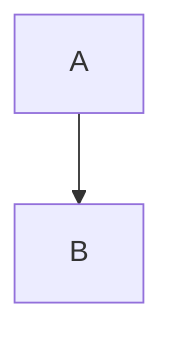

# umark

`umark` is a Rust Markdown parser workspace with:
- `umark-lib`: the parsing library
- `umark`: a small CLI wrapper

The default parsing mode is GitHub Flavored Markdown (GFM).

## Features

- CommonMark-style core parsing
- GFM extensions: tables, task lists, strikethrough, literal autolinks (`https://...`, `www...`, emails), footnotes, Mermaid fenced chart blocks (```` ```mermaid ````), reference links (`[label]: https://...`), and ordered list start values (`3. item`)
- Raw HTML passthrough in regular mode
- Safe parsing mode that rejects script tags and raw HTML

## Project Layout

- `umark-lib/src/lib.rs`: parser implementation and public API
- `umark/src/main.rs`: CLI entrypoint

## Build

```bash
cargo build
```

## CLI Usage

```bash
umark <input.md> <output.html> [--flavor gfm|commonmark] [--safe]
```

Examples:

```bash
# Default GFM parsing
umark README.md README.html

# CommonMark mode
umark README.md README-commonmark.html --flavor commonmark

# Safe mode (rejects raw HTML and script tags)
umark -- README.md README-safe.html --safe
```

## Library Usage

### Parse a Markdown string

```rust
use umark_lib::parse;

let html = parse("# Hello");
assert!(html.contains("<h1>Hello</h1>"));
```

### Choose parsing flavor

```rust
use umark_lib::{parse_with_flavor, MarkdownFlavor};

let gfm = parse_with_flavor("~~done~~", MarkdownFlavor::Gfm);
let commonmark = parse_with_flavor("~~done~~", MarkdownFlavor::CommonMark);

assert!(gfm.contains("<del>done</del>"));
assert!(!commonmark.contains("<del>done</del>"));
```

### Safe parsing

```rust
use umark_lib::safe_parse;

assert!(safe_parse("normal text").is_ok());
assert!(safe_parse("<script>alert(1)</script>").is_err());
assert!(safe_parse("x <span>raw html</span>").is_err());
```

### Parse from file

```rust
use umark_lib::parse_from_file;

parse_from_file("input.md", "output.html")?;
# Ok::<(), Box<dyn std::error::Error>>(())
```

### Parse from file in safe mode

```rust
use umark_lib::safe_parse_from_file;

safe_parse_from_file("input.md", "output.html")?;
# Ok::<(), Box<dyn std::error::Error>>(())
```

## Mermaid Chart Support

In GFM mode:

````markdown

````

is rendered as:

```html
<pre class="mermaid">flowchart TD
  A --&gt; B</pre>
```

When using `parse_from_file*` in GFM mode and Mermaid blocks are present, a Mermaid runtime script is automatically appended to the output HTML so charts render in a browser.

## Safety Notes

- `safe_parse*` rejects any raw HTML and script tags.
- `parse*` allows raw HTML passthrough.
- Safe mode is stricter by design and may reject content that regular parsing accepts.


